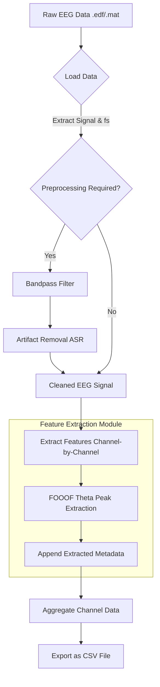

# Modular EEG Feature Extraction Pipeline

This directory contains a modular pipeline for extracting Event-Related Potentials (ERP) and Power Spectral Density (PSD) features from multi-channel EEG data. It is designed to automatically loop over all channels in your dataset, apply feature mathematical procedures exactly as defined in your original notebooks, and output a structured `.csv` file.

## Directory Structure

* **`config.py`**: Defines the constants and parameters for preprocessing and feature extraction (e.g., FOOOF theta band, Welch segment sizes, ASR cutoff). Change variables here to alter pipeline behavior globally.
* **`preprocessing.py`**: Handles EEG signal cleaning. Contains the `preprocess_eeg` function which applies a Butterworth bandpass filter and `asrpy` cleaning.
* **`features.py`**: Contains the generic `FeatureExtractor` base class, and the implemented `FOOOFThetaPeakExtractor` which computes the FOOOF theta peak frequency keeping the original mathematics.
* **`pipeline.py`**: The main orchestrator script. It loads `.edf` or `.mat` files, applies preprocessing, and delegates feature extraction across all available channels.

## Pipeline Architecture (Block Diagram)

Below is the step-by-step flowchart of the data processing pipeline:



## How to Run the Pipeline

You can run the pipeline directly via your terminal.

```bash
cd feature_extraction
python pipeline.py --input /path/to/your/data.edf --output results.csv --subject "Subj_01" --condition "Task_A"
```
example 2 - 
```
$  python3 pipeline.py --input /Volumes/ss/Project_EEG/DATASET/Ana_MS_Thesis/Terracciano1B.edf --output /Volumes/ss/Project_EEG/DATASET/Ana_MS_Thesis/results.csv --subject "Terracciano1B.edf"
```
### Arguments:
* `--input`: Path to the `.edf` or `.mat` file (Required).
* `--output`: Output CSV filename (Default: `features_extracted.csv`).
* `--subject`: The subject ID to attach as metadata to the CSV rows (Optional).
* `--condition`: The condition or task name to attach as metadata (Optional).
* `--no_preprocess`: Add this flag if you want to skip the Bandpass & ASR preprocessing steps.

## CSV Output Format

The output is a structured CSV file (`results.csv` or otherwise specified) where **each row represents a single EEG channel's extracted features**.

The columns generally follow this structure:

| Column Name | Description |
| :--- | :--- |
| `channel` | The name of the EEG channel (e.g., `Fp1-Av`, `Cz-Av`). |
| `subject` | The subject ID provided via the `--subject` argument. |
| `condition` | The experimental condition provided via `--condition`. |
| `fs` | The sampling frequency of the recorded data. |
| `fooof_theta_*` | Extracted features from the FOOOF module (e.g., `fooof_theta_peak_freq`, `fooof_theta_peak_power`, `fooof_theta_peak_bw`). |
| `[extractor_name]_[feature_name]` | Any dynamically added features from additional extractors in `features.py`. |

## Running inside a Jupyter Notebook or Python Script

You can also import the pipeline directly into a Jupyter Notebook cell:

```python
import mne
from feature_extraction.pipeline import run_pipeline

# 1. Load your data
data = mne.io.read_raw_edf("Andreas.edf", preload=True)
raw_data = data.get_data()
fs = data.info['sfreq']
ch_names = data.ch_names

metadata = {"subject": "Andreas", "session": "1"}

# 2. Execute pipeline
# apply_preprocess=True will run the `preprocess_eeg` function
df = run_pipeline(raw_data, fs, ch_names, metadata, apply_preprocess=True)

# 3. Save to CSV
df.to_csv("extracted_features.csv", index=False)
```

## How to Add New Features

The pipeline is highly modular. To add a new feature (e.g., Alpha Peak, ERP Amplitude):

1. **Create your extractor class**: Open `features.py` and create a new class that inherits from `FeatureExtractor`. Define your extraction logic inside the `extract()` method. It must return a Python dictionary of your feature names and values.
   
```python
class MyNewExtractor(FeatureExtractor):
    def extract(self, signal: np.ndarray, fs: float) -> dict:
        # Include your math here!
        my_feature_value = np.mean(signal) 
        return {"mean_value": my_feature_value}
```

2. **Register the extractor**: Open `pipeline.py` and add an instance of your new class into the `extractors` dictionary inside the `run_pipeline()` function.

```python
    extractors = {
        "fooof_theta": FOOOFThetaPeakExtractor(...),
        "my_new_feature": MyNewExtractor() # <--- add it here
    }
```

The pipeline will now automatically execute this new feature extractor on every channel and the corresponding values will appear as columns in your output CSV!
